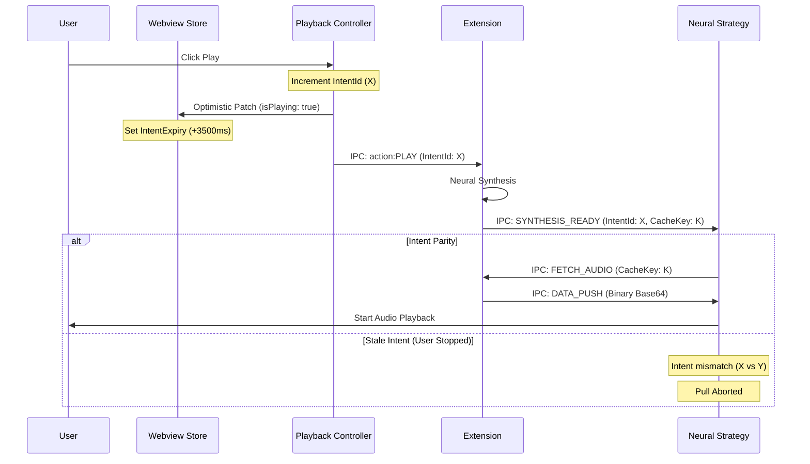

# Autoplay Orchestration

This skill defines the authoritative architecture for the Read Aloud playback engine. It replaces ad-hoc "Guards" with a formal state machine to ensure zero "play override" issues and robust state transitions.

## 1. System Dynamics

The system revolves around the **Sovereign Intent Baton**. 
- **Acquire**: The user (or auto-next) initiates an action. A new `intentId` (Baton) is minted **only** for disruptive actions (Stop, Jump, Manual Play). 
- **Continuity**: Seamless transitions (next sentence/pre-fetch) **inherit** the current Baton.
- **Execution Phases**:
    - **Call**: Extension is notified of the intent.
    - **Synthesis**: Extension prepares the audio.
    - **Play**: Webview receives audio and plays it IF the baton hasn't moved (Baton Magnitude Check).
    - **Reject**: Stale intents (lesser baton magnitude) are immediately discarded by the "Zombie Guard".

### Temporal Handshake

The diagram below illustrates the timing relationship between intent creation and synchronization.

## 2. State Variable Analysis

| Variable | Scope | Purpose | Rule |
| :--- | :--- | :--- | :--- |
| `playbackState` | WebviewStore | Current engine state (IDLE, PLAYING, etc.) | Canonical Source of Truth for UI. |
| `playbackIntent` | WebviewStore | User's desired state. | Used for reconciliation with Extension syncs. |
| `lastIntentId` | WebviewStore | Incremental counter for every state change. | **Sovereignty Key**: Data with older IDs must be discarded. |
| `isAwaitingSync` | WebviewStore | UI Lock during transition. | Prevents rapid fire commands while extension is processing. |

## 3. Timing Registry (TTL)

| Parameter | Value | Entity | Purpose |
| :--- | :--- | :--- | :--- |
| `INTENT_TIMEOUT_MS` | 3500ms | WebviewStore | Sovereignty window encompassing synthesis latency. |
| `FETCH_TIMEOUT` | 5000ms | NeuralStrategy | Timeout for the Pull-Fetch handshake before giving up. |
| `SYNC_GRACE_PERIOD` | 400ms | WebviewStore | Delay before showing "Loading" spinner during syncs. |
| `PASSAGE_HOLD_SEC` | 10s | NeuralStrategy | Immunity window for segments with matching `intentId`. |

## 4. The "Guard" Consolidation

### Sovereignty Guard (WebviewStore)
Blocks extensions syncs that contradict the last user intent within the 3500ms `intentExpiry` window.

### Reactive Pull Handshake (NeuralAudioStrategy)
Replaces the "unsolicited push" model. The strategy now waits for a `SYNTHESIS_READY` notification and explicitly requests data.
- **Rule**: Never ingest data unless an active pull request exists for that specific `cacheKey` and `intentId`.
- **Refinement**: If `intentId` matches the current active intent, the segment is NOT a zombie and must be fetched/buffered, regardless of temporary UI sync transitions.

## 4. Trigger System

- **USER_PRIMARY**: Direct clicks on Play/Pause. Triggers immediate optimistic patch.
- **AUTO_NEXT**: End of sentence. Extension-driven. No optimistic patch; waits for `UI_SYNC`.
- **HALT_INTERRUPT**: Stop command or Chapter Jump. Must flush all in-flight buffers.

## 5. Head Abstraction (Future Proofing)

The Orchestrator must be decoupled from the specific Sidebar or Webview implementation.
- **State Registry**: All UI "Heads" must subscribe to the same `WebviewStore` for state.
- **Action Inversion**: Heads do not trigger logic; they emit "Intent Requests" (e.g., `REQUEST_PLAY`) to the Orchestrator.
- **Auditory Parity**: The Auditory Strategy (Neural/Local) is the only component allowed to mark a sentence as "Finished".

## 6. Implementation Protocol

1. **State Latching**: Always update `intentId` before sending commands to the extension.
2. **Buffer Immunity**: Blobs tagged with the *current* `intentId` are immune to pruning for 5 seconds.
3. **Optimistic Locking**: Use `isAwaitingSync` to prevent "Command Overlap" (e.g., clicking Pause while a Play sync is in transit).
