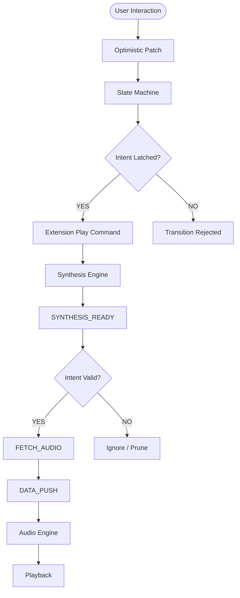
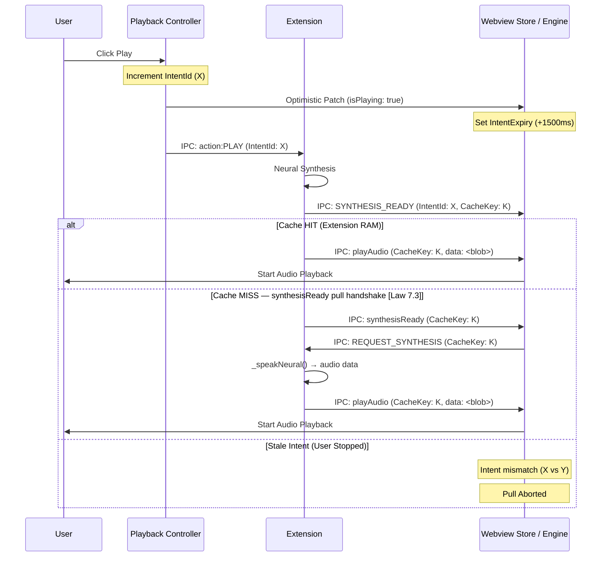

# Autoplay Orchestration

This skill defines the authoritative architecture for the Read Aloud playback engine. It replaces ad-hoc "Guards" with a formal state machine to ensure zero "play override" issues and robust state transitions.

## 1. System Dynamics

The system revolves around the **Sovereign Intent Baton**. 
- **Acquire**: The user (or auto-next) initiates an action. A new `intentId` (Baton) is minted **only** for disruptive actions (Stop, Jump, Manual Play). `batchId` is incremented for every **manual gesture**.
- **Continuity**: Seamless transitions (auto-next/pre-fetch) **inherit** the current `batchId` to maintain sequence continuity, while disruptive jumps reset the context.
- **Execution Phases**:
    - **Call**: Extension is notified of the intent.
    - **Synthesis**: Extension prepares the audio.
    - **Play**: Webview receives audio and plays it IF the baton hasn't moved (Baton Magnitude Check).
    - **Reject**: Stale intents (lesser baton magnitude) are immediately discarded by the "Zombie Guard".



### Temporal Handshake

The diagram below illustrates the timing relationship between intent creation and synchronization.



## 2. State Variable Analysis

| Variable | Scope | Purpose | Rule |
| :--- | :--- | :--- | :--- |
| `playbackState` | WebviewStore | Current engine state (IDLE, PLAYING, etc.) | Canonical Source of Truth for UI. |
| `playbackIntent` | WebviewStore | User's desired state. | Used for reconciliation with Extension syncs. |
| `lastIntentId` | WebviewStore | Incremental counter for every state change. | **Sovereignty Key**: Data with older IDs must be discarded. |
| `isAwaitingSync` | WebviewStore | UI Lock during transition. | Prevents rapid fire commands while extension is processing. |
| `batchId` | Both | Monotonic sequence ID. | Tracks manual vs auto-advance chunks. |

## 3. Timing Registry (TTL)

| Parameter | Value | Entity | Purpose |
| :--- | :--- | :--- | :--- |
| `INTENT_TIMEOUT_MS` | 1500ms | WebviewStore | Sovereignty window encompassing synthesis latency. |
| `FETCH_TIMEOUT` | 5000ms | Webview Audio Engine | Timeout for the Pull-Fetch handshake before giving up. |
| `SYNC_GRACE_PERIOD` | 400ms | WebviewStore | Delay before showing "Loading" spinner during syncs. |
| `PASSAGE_HOLD_SEC` | 10s | Webview Audio Engine | Immunity window for segments with matching `intentId`. |

## 4. The "Guard" Consolidation

### Sovereignty Guard (WebviewStore)
Blocks extensions syncs that contradict the last user intent within the 1500ms `intentExpiry` window. Implements **Segmented Sovereignty**: allows Telemetry fields to pass while filtering Disruptive fields during the window.

### Reactive Pull Handshake (WebviewAudioEngine)
Replaces the "unsolicited push" model. The engine now waits for a `SYNTHESIS_READY` notification and explicitly requests data.
- **Rule**: Never ingest data unless an active pull request exists for that specific `cacheKey` and `intentId`.
- **Refinement**: If `intentId` matches the current active intent, the segment is NOT a zombie and must be fetched/buffered, regardless of temporary UI sync transitions.

### Monotonic Batch Hardening 
Ensures that synthesis and playback never drift due to Batch 0 leakage.
- **Rule**: Minimum valid `batchId` is 1.
- **Protocol**: If a request arrives at the Extension with ID 0, it must be hardened (auto-upgraded) to 1 or the current authoritative IDs (`playbackIntentId` and `batchId`) before starting synthesis.

## 4. Trigger System

- **USER_PRIMARY**: Direct clicks on Play/Pause. Triggers immediate optimistic patch.
- **AUTO_NEXT**: End of sentence. Extension-driven. No optimistic patch; waits for `UI_SYNC`.
- **HALT_INTERRUPT**: Stop command or Chapter Jump. Must flush all in-flight buffers.

## 5. Head Abstraction (Future Proofing)

The Orchestrator must be decoupled from the specific Sidebar or Webview implementation.
- **State Registry**: All UI "Heads" must subscribe to the same `WebviewStore` for state.
- **Action Inversion**: Heads do not trigger logic; they emit "Intent Requests" (e.g., `REQUEST_PLAY`) to the Orchestrator.
- **Auditory Parity**: The Auditory Strategy (Neural/Local) is the only component allowed to mark a sentence as "Finished".

## 6. Implementation Protocol

1. **State Latching**: Always update `intentId` before sending commands to the extension.
2. **Buffer Immunity**: Blobs tagged with the *current* `intentId` are immune to pruning for 5 seconds.
3. **Optimistic Locking**: Use `isAwaitingSync` to prevent "Command Overlap" (e.g., clicking Pause while a Play sync is in transit).

---

## 7. Bridge Integrity Laws ⚖️

> **Observed: 2026-04-10.** These laws are BINDING for any agent modifying `mcpBridge.ts`
> or the `PULL_FETCH` / `FETCH_FAILED` code paths.

### Law 7.1 — FETCH_FAILED Fallback Guard (No Redundant Synthesis on Disk-Hit)

**Problem:** The extension bridge emits `playAudio` after a Tier-2 disk hit hydrates the Webview
`CacheManager`. However, the bridge-side `PULL_FETCH` timeout does not wait for the webview's
hydration acknowledgment. If the webview ACKs a disk-hydration **after** the fetch timeout fires,
the bridge incorrectly classifies the fetch as `FETCH_FAILED` and triggers a full re-synthesis —
burning a NEURAL lock on audio that already exists on disk.

**Canonical Diagnostic Signature:**
```
[BRIDGE_WARN] FETCH_FAILED: <key>. Proactively triggering synthesis fallback.
[CACHE HIT] key:<same key> | Size: XX.XKB
```
These two lines for the **same key** in rapid succession confirm the bug is active.

**Law:** The `FETCH_FAILED` fallback path MUST check if the Webview confirmed a
`CACHE_STATS_UPDATE` for the same `cacheKey` within the preceding 200ms window before
classifying a fetch as truly failed. If a recent cache confirmation exists for the key, the
bridge MUST emit `playAudio` with the disk-cached key directly — synthesis MUST NOT be triggered.

```typescript
// REQUIRED guard in mcpBridge.ts — FETCH_FAILED handler
private _recentCacheConfirmations = new Map<string, number>(); // key → timestamp

// Called when webview sends CACHE_STATS_UPDATE:
private onCacheStatsUpdate(key: string) {
    this._recentCacheConfirmations.set(key, Date.now());
}

// Called in FETCH_FAILED fallback path:
private onFetchFailed(key: string, intentId: number) {
    const confirmedAt = this._recentCacheConfirmations.get(key);
    if (confirmedAt && Date.now() - confirmedAt < 200) {
        // Webview already has this — skip synthesis, emit playAudio directly
        this.emit('playAudio', { cacheKey: key, intentId });
        return;
    }
    // Truly failed — proceed with synthesis fallback
    this._startSynthesisFallback(key, intentId);
}
```

**Verification:** After the fix, `[BRIDGE_WARN] FETCH_FAILED` MUST NOT be followed by
`[CACHE HIT]` for the same key. The `[BRIDGE] >> EMIT synthesisStarting` event MUST NOT fire
for a key that already has a confirmed Tier-2 disk hit.

---

### Law 7.2 — SYNTHESIS_STARTING Deduplication Guard

**Problem:** When `FETCH_FAILED` triggers the synthesis fallback path (Law 7.1), the bridge
emits a second `SYNTHESIS_STARTING` for the same `cacheKey` that already received a
`SYNTHESIS_STARTING` in the primary path. The Webview `Dispatcher` processes both signals,
causing redundant render cycles and confusing state transitions.

**Law:** The bridge MUST maintain a `Set<string>` of in-flight `SYNTHESIS_STARTING` emissions,
scoped to the current `intentId`. The key for this set MUST be `${cacheKey}::${intentId}`.
If an entry is already in the set, any subsequent `SYNTHESIS_STARTING` emission for the same
pair MUST be silently suppressed — regardless of the code path that triggered it.

```typescript
// REQUIRED guard in mcpBridge.ts — synthesisStarting emitter
private _emittedSynthesisStarting = new Set<string>();

private emitSynthesisStarting(cacheKey: string, intentId: number) {
    const guard = `${cacheKey}::${intentId}`;
    if (this._emittedSynthesisStarting.has(guard)) return; // Deduplicated
    this._emittedSynthesisStarting.add(guard);
    this.emit('synthesisStarting', { cacheKey, intentId });
}

// Clear on intent increment:
private onIntentIncrement() {
    this._emittedSynthesisStarting.clear();
}
```

**Verification:** For any given `cacheKey + intentId` pair, exactly **1**
`[WEBVIEW INFO] [HOST->WEBVIEW] [SYNTHESIS_STARTING]` line in the diagnostics log.

---

### Law 7.3 — `playAudio` Single-Emission Contract (Cache-Miss Path)

> **Observed: 2026-04-10.** Source: `audioBridge.ts` cache-miss branch. Commit: `112fafe`.

**Problem:** The cache-miss `else` branch in `audioBridge.start()` previously emitted a speculative
`playAudio` with `data: ''` before synthesis had begun — violating the contract that `playAudio`
means "here is audio, play it." This caused `WebviewAudioEngine` to initiate two competing
`AudioBufferSourceNode` decodes for the same intent → pitch corruption, 2×–16× speed, or silence.

**Root Cause:** The emission was added as an optimistic pre-warm hint but the webview's
`CommandDispatcher` has no "receive playAudio, wait for data" branch — it immediately attempted
`playFromCache → FETCH_AUDIO`, racing against the real synthesis landing.

**Law:** The `playAudio` event MUST be emitted **exactly once per sentence**, by `_speakNeural()`,
only AFTER synthesis has produced real audio data. The cache-miss `start()` path MUST emit
**only `synthesisReady`** to initiate the pull handshake. The handshake flow is:

```
start() cache-miss
  → emit synthesisReady { cacheKey }
  → [webview] miss → REQUEST_SYNTHESIS
  → synthesize() → _speakNeural()
  → emit playAudio { cacheKey, data: <blob> }   ← SINGLE authoritative emission
```

**Enforcement:**
```typescript
// ✅ CORRECT — in audioBridge.ts cache-miss branch:
this._emitWithIntent('synthesisReady', { cacheKey }); // Only this. Nothing else.

// ❌ WRONG — must never appear in cache-miss:
this._emitWithIntent('playAudio', { cacheKey, data: '', ... }); // Violates contract
```

**Test:** `tests/core/audioBridge.bridge.test.ts` — Law 7.3 describe block:
asserts that `start()` on a cache-miss emits `synthesisReady` (×1) and zero `playAudio(data:'')` signals.

**Verification:** In `diagnostics.log`, for a cache-miss sentence:
- ✅ One `[BRIDGE] >> EMIT synthesisReady`
- ✅ Zero `[BRIDGE] >> EMIT playAudio` from `start()` (only one from `_speakNeural`)
- ✅ One `FETCH_AUDIO` round-trip, not two
- ✅ Audio starts promptly with correct pitch and speed

**Known Design Gap — LOAD_DOCUMENT without Play Intent:**
If the user presses **Load File** (dispatches `LOAD_DOCUMENT`) and then **Play** (dispatches
`TOGGLE_PLAY_PAUSE` or `CONTINUE`), the audio bridge has no active sentence/intent → silence.
`LOAD_DOCUMENT` alone calls `loadCurrentDocument()` — it does NOT call `start()` or prime the bridge.
The `LOAD_AND_PLAY` action is the correct atomic path for load + immediate playback.
Any "Play after Load" UX flow MUST either:
1. Use `LOAD_AND_PLAY` directly, OR
2. Guard `continue()` with a fallback to `start(0, 0, options)` when no active intent exists.

**Webview-Side Enforcement (playbackController.ts):**
The `play()` method in `playbackController.ts` contains a **Law 7.3 Play Guard**: if `resolvedUri`
is empty (which occurs immediately after `LOAD_DOCUMENT` before any synthesis has run),
`REQUEST_SYNTHESIS` is suppressed. The extension's `PLAY → continue() → audioBridge.start()` path
is the sole authoritative driver for first-play after a fresh load. (Commit: `6b341ee`, 2026-04-10)

---

### Issue #26 — Ghost Focus Auto-Load (Pending Fix)

> [!IMPORTANT]
> **Status**: Confirmed architectural violation. Fix scheduled. Do NOT ship without resolving.

**Problem:** When the user switches to a new file in the VS Code editor (passive tab change),
`extension.ts:syncSelection()` calls `setActiveEditor()`, which updates `focusedDocumentUri`
and `focusedFileName` in `StateStore`. However, there is a code path that also triggers
`loadCurrentDocument()` (or sets chapter state) on focus change, which overwrites the
**Loaded File** slot in the UI — bypassing the explicit **Load File** button mechanism entirely.

**Architectural Contract (BINDING):**
```
focusedDocumentUri   → Updated by syncSelection() on EVERY tab/editor change. Passive only.
activeDocumentUri    → Updated EXCLUSIVELY by loadCurrentDocument(). Explicit user intent only.
```

The `DocController`, `StateStore.setActiveDocument()`, and any chapter-loading logic MUST
only be invoked from the `LOAD_DOCUMENT` IPC path — never from `syncSelection()` or any
passive focus tracker.

**Diagnostic Signature (confirm bug is live):**
- User opens File A → clicks **Load File** → chapter headers show File A.
- User switches to File B in editor (no Load File action).
- Chapter headers update to File B — **this is the violation**.

**Fix Scope (when scheduled):**
1. Audit `extension.ts:syncSelection()` — ensure it calls ONLY `setActiveEditor()` / `setFocusedDocument()`, never `loadCurrentDocument()`.
2. Audit `speechProvider.ts` message handler for any `case` that calls `loadCurrentDocument()` on a focus event.
3. Add a regression test: switch tabs, assert `activeDocumentUri` in `StateStore` is unchanged.
4. Update `system_context § 2.1` to formalize the Focused/Loaded duality as a named invariant.
