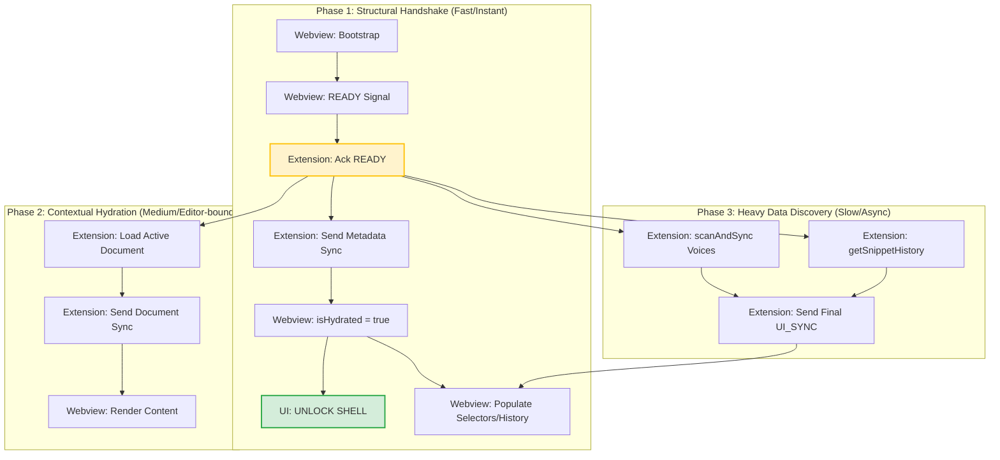

# Startup Orchestration Protocol

## 1. Dependency Graph (Visualization)

The following graph defines the authoritative startup sequence. Nodes are categorized by their impact on UI responsiveness.



## 2. Blocking States & Mitigation

| State | Blockage Type | Logic Gate | Mitigation Strategy |
| :--- | :--- | :--- | :--- |
| `ScanAndSync` | Asynchronous (Heavy) | Pre-Handshake | Move to **Phase 3**. Send structural sync BEFORE awaiting voice discovery. |
| `getSnippetHistory` | Asynchronous (I/O) | Pre-Handshake | Move to **Phase 3**. Discover history in background; update UI incrementally. |
| `isHydrated` | Handshake Gate | UI Interactivity | Bind to **Phase 1 (ACK)**. MUST be sent as `true` in Pulse 1 to prevent "Dead UI". |
| `pointer-events: none` | CSS Block | `is-loading` class | Class should be removed as soon as **Phase 1** completes. |

## 3. Implementation Guidelines

### 3.1 Extension side (`SpeechProvider.ts`)
- `_sendInitialState()` MUST NOT `await` heavy operations before sending the first `sync()`.
- Use a "Triple-Pulse" sync strategy:
    1.  **ACK Pulse**: Immediate empty sync with `isHydrated: true`.
    2.  **Context Pulse**: Sync after `loadCurrentDocument`.
    3.  **Data Pulse**: Sync after `scanAndSync` and history discovery.

### 3.2 Webview side (`WebviewStore.ts`)
- Ensure `patchState` can handle partial updates without regressing the hydration state.
- `isLoadingVoices` should be a separate transient flag to show a specific spinner in the Voice Selector, rather than blocking the global UI.

### 3.3 SSOI (Single Source of Intent)
- Initial `playbackIntentId` MUST be preserved through the sequence to ensure that any user command sent *during* hydration (e.g., "Stop") takes precedence over late-arriving data packets.

### 3.4 Focused vs Active Document Duality

> [!IMPORTANT]
> These are two distinct state fields with different lifecycle semantics. Binding the wrong one to UI
> causes the "auto-loading" regression where switching tabs overwrites the Loaded File display.

| Field | Updated By | Semantics | UI Usage |
|---|---|---|---|
| `focusedDocumentUri` / `focusedFileName` | `setActiveEditor()` on every tab change | **Passive** — tracks cursor location. Updates on every `onDidChangeActiveTextEditor` event. | "Focused File" (read-only indicator). MUST NOT be used for "Loaded File" display. |
| `activeDocumentUri` / `activeDocumentFileName` | `loadCurrentDocument()` on explicit user action | **Active** — the document loaded for synthesis. Only updates when `LOAD_DOCUMENT` or `LOAD_AND_PLAY` succeeds. | **"Loaded File"** — the correct binding for any UI slot showing the document queued for reading. |

**Rule:** Any webview UI component displaying "Loaded File", "Current Document", or equivalent MUST
bind to `activeDocumentFileName` (or `activeDocumentUri`). Binding to `focusedFileName` will cause
the field to update silently on every tab switch, overriding the user's explicit load action.

**DPG Interaction:** `_tryInitialDocumentLoad()` calls `loadCurrentDocument()` which promotes the
focused URI to active. After this promotion, `focusedFileName` continues to track tab switches
independently — it must never again feed the "Loaded File" display slot.

**DPG Persistence Yield (Law F.1 — Issue #26):**

> [!IMPORTANT]
> If `PersistenceManager.hydrate()` has already restored an `activeDocumentUri` before `_tryInitialDocumentLoad()` fires,
> the DPG MUST NOT call `loadCurrentDocument()`. The persisted document represents the user's **explicit last-session choice**.
> Overwriting it with the currently focused editor tab is a silent auto-load violation.

```typescript
// REQUIRED guard in _tryInitialDocumentLoad():
if (this._stateStore.state.activeDocumentUri) {
    // Persisted doc exists — yield. Sync only.
    this._dashboardRelay.sync();
    return;
}
// Only reach loadCurrentDocument() if NO persisted doc exists:
await this.loadCurrentDocument(true);
```

**LOAD_DOCUMENT vs LOAD_AND_PLAY:**
- `LOAD_DOCUMENT` → `loadCurrentDocument()` → sets `activeDocumentUri` — does NOT prime audio bridge.
- `LOAD_AND_PLAY` → `loadCurrentDocument()` + `continue()` — atomic. Play button after Load File MUST use this or guard `continue()` with a `start()` fallback.

---

## 4. Gate Implementation Law ⚖️

> **This section is BINDING.** The dependency graph in §1 is not a suggestion — it is the contract.
> Every component listed below MUST implement its corresponding gate. An agent modifying any of these
> files MUST verify the gate is present and functioning before marking the task complete.

### Gate 1 — `SyncManager`: Relay-Attached Gate

**Problem:** `SyncManager` fires `_flush()` on every `StateStore.change` from construction, before
`DashboardRelay` has a view attached. This produces `👻 View Hidden — SYNCING ANYWAY` noise on every cold boot.

**Law:** `requestSync()` MUST check `_isRelayAttached` before flushing. Syncs arriving before the relay
is attached MUST be buffered (set `_needsSync = true` and return). The gate opens exactly once — when
`setView()` is called with a non-null `WebviewView`.

```typescript
// REQUIRED pattern in SyncManager.ts
private _isRelayAttached: boolean = false;

public setView(view: vscode.WebviewView | undefined) {
    this._view = view;
    if (view) {
        this._isRelayAttached = true;        // Gate opens — never closes
        if (this._needsSync) {
            this.requestSync(true);           // Flush buffered work
        }
    }
}

public requestSync(immediate = false) {
    if (!this._isRelayAttached) {
        this._needsSync = true;              // Buffer silently — no log spam
        return;
    }
    // ... existing throttle/flush logic
}
```

**Verification:** Zero `👻 View Hidden` lines in the log after a cold boot with this gate active.

---

### Gate 2 — `MCP Bridge`: Connection Coalesce Window

**Problem:** Gemini fires multiple SSE probes in rapid succession. The bridge's conflict guard
correctly evicts stale sessions, but Gemini sends *new* probes **after** each `session_active`
confirmation — clearing any short debounce window before the next probe arrives. This produces
10–14 spawn/evict cycles per cold boot.

**Root Cause (v2 insight):** The original coalesce implementation cleared `_isHandshaking` at
`session_active`. But Gemini's MCP client retries on any SSE disconnect — so each eviction
triggers a new probe ~50ms later, outside the now-closed window.

**Law:** The coalesce window MUST be held **open for the full lifetime of the active session**,
not just during the initial handshake. It MUST only be cleared when the SSE connection closes
(req `close` event). New connections arriving while a session is alive are a signal that the
existing session is still healthy — they MUST be absorbed, not evicted.

```typescript
// REQUIRED pattern in the MCP bridge server
private _activeSession: boolean = false;   // Replaces short-lived _isHandshaking

private onSseConnect(req: Request, res: Response) {
    if (this._activeSession) {
        // A live session exists — absorb the probe, do not evict or spawn
        res.status(429).end();
        return;
    }
    this._activeSession = true;

    // Gate opens only when this connection closes
    req.on('close', () => {
        this._activeSession = false;
    });

    this._spawnAndConnect(req, res);
}
```

**Verification:** Exactly **1** `[MCP_BRIDGE] Spawning New Server Instance` line per cold boot.
No eviction cycles (`Evicting stale instance`) during a stable session.

---

### Gate 3 — `NEURAL` Client: Lock-Aware Disposal

**Problem:** `forceReset()` disposes the NEURAL synthesis client while a mutex lock is still held,
causing `Cannot read properties of undefined (reading 'readyState')` in the lock's resolution path.

**Law:** `forceReset()` MUST check if a synthesis lock is active. If a lock is held, it MUST set
`_pendingReset = true` and return immediately. The actual disposal runs at the top of the lock
release handler, before the next task is dequeued.

```typescript
// REQUIRED pattern in the NEURAL client / WebviewAudioEngine
private _pendingReset = false;
private _activeLockKey: string | null = null;

public forceReset(): void {
    if (this._activeLockKey !== null) {
        this._pendingReset = true;           // Deferred — lock is hot
        return;
    }
    this._executeDisposal();
}

private releaseLock(key: string): void {
    this._activeLockKey = null;
    if (this._pendingReset) {
        this._pendingReset = false;
        this._executeDisposal();             // Deferred reset fires here
        return;
    }
    this._dequeueNext();                     // Normal path
}
```

**Verification:** Zero `☢️ Critical library corruption during metadata` lines during the first
synthesis request of a cold boot.

---

### Gate 4 — `NEURAL` Client: TTS Warm-Up Gate

**Problem:** `MsEdgeTTS` establishes a WebSocket connection lazily on first use. On cold boot,
the first `setMetadata()` call fires before the WebSocket is open, causing `readyState` to be
`undefined` — triggering `☢️ Critical library corruption` even though the library is healthy.
Gate 3 correctly defers disposal, but the synthesis still fails on the first attempt.

**Root Cause:** The NEURAL client has no awareness of whether its underlying transport is ready.
The first synthesis call always races against the WebSocket open event.

**Law:** The NEURAL client MUST maintain a `_ttsReady` promise that resolves when the TTS
library confirms its transport is open. All synthesis requests MUST `await this._ttsReady`
before calling `setMetadata()`. On `_reinitTTS()`, the promise MUST be reset.

```typescript
// REQUIRED pattern in PlaybackEngine.ts / NEURAL client
private _ttsReady: Promise<void>;
private _resolveTtsReady!: () => void;

private _resetTtsReadyGate() {
    this._ttsReady = new Promise(r => this._resolveTtsReady = r);
}

private _executeReinit() {
    this._resetTtsReadyGate();          // Reset gate before new client
    this._tts = new MsEdgeTTS();
    // Warm up: fire a zero-cost probe to open the WebSocket
    this._tts.toStream('', {}).then(() => this._resolveTtsReady())
             .catch(() => this._resolveTtsReady());  // Open the gate even on error
}

private async _getNeuralAudio(...) {
    await this._ttsReady;               // Block until transport confirmed open
    await this._tts.setMetadata(...);
    // ...
}
```

**Verification:** Zero `☢️ Critical library corruption during metadata` lines on first synthesis
after cold boot. Gate 3 deferred reinit (`⏳ Re-init deferred`) should no longer trigger at all
for the first synthesis call.

---

### Gate 5 — `SyncManager`: Request Debounce Coalescer

**Problem:** Multiple independent state change events (`active_document_updated`, `active_mode_updated`,
`sentenceChanged`, `pulse_1`, `pulse_2`) all call `requestSync()` within the same ~100ms boot window.
This produces 4–6 redundant `UI_SYNC` packets before the webview has rendered its first frame.

**Law:** `requestSync()` MUST coalesce all calls arriving within a 50ms window into a single flush.
This replaces any existing debounce timer with a fixed coalesce window that starts on the **first**
call and fires once at the end — not on each call.

```typescript
// REQUIRED pattern in SyncManager.ts
private _coalesceTimer: ReturnType<typeof setTimeout> | null = null;
private static readonly COALESCE_MS = 50;

public requestSync(immediate = false) {
    if (!this._isRelayAttached) { this._needsSync = true; return; }
    if (immediate) { this._flush(); return; }
    if (this._coalesceTimer) return;    // Window already open — absorb silently
    this._coalesceTimer = setTimeout(() => {
        this._coalesceTimer = null;
        this._flush();
    }, SyncManager.COALESCE_MS);
}
```

**Verification:** At most **2** `[RELAY] ✅ postMessage successful: UI_SYNC` lines during the
boot sequence (one for Pulse 1, one for Pulse 2). No duplicate syncs from the same trigger.

#### Gate 5 Addendum — Intent-Stable Coalesce (Live Playback)

> **Observed: 2026-04-10.** Gate 5 governs boot-time sync coalescing. However, the same
> redundant `UI_SYNC` burst pattern also occurs **during active playback** — two identical
> `[RELAY] 📦 Assembled Packet` lines in the same timestamp with identical `intent`, `chapters`,
> and `hydrated` fields. Document observer ticks can reopen the coalesce timer during playback,
> bypassing the gate's boot-time guard.

**Addendum Law:** `SyncManager._flush()` MUST compute a shallow hash of the outgoing packet
before transmitting — specifically `chapters + intent + hydrated + isPlaying`. If the hash
matches the last-flushed hash **AND** `isPlaying === true`, the flush MUST be silently absorbed
(no postMessage, no log). The hash MUST be cleared on any user action or intent increment.

```typescript
// REQUIRED addendum in SyncManager.ts — _flush()
private _lastFlushHash: string = '';

private _flush() {
    const packet = this._buildPacket();

    // Gate 5 Addendum: suppress state-equivalent flushes during playback
    if (packet.isPlaying) {
        const hash = `${packet.chapters}|${packet.intent}|${packet.hydrated}|${packet.isPlaying}`;
        if (hash === this._lastFlushHash) return; // Absorbed — no change
        this._lastFlushHash = hash;
    } else {
        this._lastFlushHash = ''; // Clear on idle state — always allow next flush
    }

    this._relay.postMessage('UI_SYNC', packet);
}
```

**Verification:** During steady-state playback (no user action, no sentence advance), zero
redundant `[RELAY] 📦 Assembled Packet` lines within any 500ms window.

---

### Hygiene Rule — Voice Scan Idempotency

**Problem:** `VOICE_SCAN SUCCESS: Found 322 neural voices` fires multiple times because each
post-handshake MCP broadcast triggers a scan re-emission. The webview receives the same 322-voice
payload N times — once per spawned instance's broadcast.

**Law:** The voice scan emitter MUST cache the last-emitted voice list hash. A new `voices`
postMessage MUST only be sent if the resolved list has changed since the last emission.

```typescript
// REQUIRED pattern in the voice scan / relay layer
private _lastVoiceHash: string = '';

private _emitVoices(neuralVoices: NeuralVoice[]) {
    const hash = neuralVoices.map(v => v.id).join(',');
    if (hash === this._lastVoiceHash) return;   // Idempotent — no-op
    this._lastVoiceHash = hash;
    this._relay.postMessage('voices', { neuralVoices });
}
```

**Verification:** Exactly **1** `[RELAY] ✅ postMessage successful: voices` line per cold boot,
regardless of how many MCP bridge broadcasts complete.

---

## 5. Gate Verification Checklist

Before marking any startup-related task complete, confirm:

- [ ] **Gate 1**: `SyncManager` — no `👻 View Hidden` lines during cold boot
- [ ] **Gate 2**: `MCP Bridge` — exactly **1** `Spawning New Server Instance` + 0 eviction cycles on stable session
- [ ] **Gate 3**: `NEURAL` client — no `☢️ Critical library corruption` (deferred reinit) on first synthesis
- [ ] **Gate 4**: `NEURAL` TTS — no `readyState` errors; first synthesis succeeds without retry
- [ ] **Gate 5**: `SyncManager` — ≤2 `postMessage successful: UI_SYNC` lines during boot sequence
- [ ] **Voices** — exactly **1** `postMessage successful: voices` per cold boot
- [ ] **Phase 1** completes in < 100ms (check `[ReadAloud] ✅ Webview Handshake Complete` timestamp)
- [ ] **Phase 3** does NOT block Phase 1 (voices arrive after `isHydrated: true` is sent)
