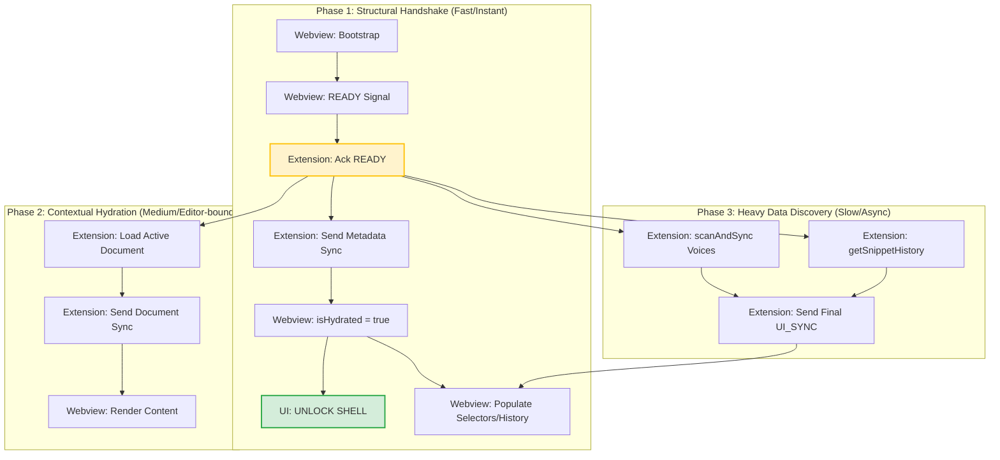

# Startup Orchestration Protocol

## 1. Dependency Graph (Visualization)

The following graph defines the authoritative startup sequence. Nodes are categorized by their impact on UI responsiveness.

## 2. Blocking States & Mitigation

| State | Blockage Type | Logic Gate | Mitigation Strategy |
| :--- | :--- | :--- | :--- |
| `ScanAndSync` | Asynchronous (Heavy) | Pre-Handshake | Move to **Phase 3**. Send structural sync BEFORE awaiting voice discovery. |
| `getSnippetHistory` | Asynchronous (I/O) | Pre-Handshake | Move to **Phase 3**. Discover history in background; update UI incrementally. |
| `isHydrated` | Handshake Gate | UI Interactivity | Bind to **Phase 1 (ACK)**. MUST be sent as `true` in Pulse 1 to prevent "Dead UI". |
| `pointer-events: none` | CSS Block | `is-loading` class | Class should be removed as soon as **Phase 1** completes. |

## 3. Implementation Guidelines

### 3.1 Extension side (`SpeechProvider.ts`)
- `_sendInitialState()` MUST NOT `await` heavy operations before sending the first `sync()`.
- Use a "Triple-Pulse" sync strategy:
    1.  **ACK Pulse**: Immediate empty sync with `isHydrated: true`.
    2.  **Context Pulse**: Sync after `loadCurrentDocument`.
    3.  **Data Pulse**: Sync after `scanAndSync` and history discovery.

### 3.2 Webview side (`WebviewStore.ts`)
- Ensure `patchState` can handle partial updates without regressing the hydration state.
- `isLoadingVoices` should be a separate transient flag to show a specific spinner in the Voice Selector, rather than blocking the global UI.

### 3.3 SSOI (Single Source of Intent)
- Initial `playbackIntentId` MUST be preserved through the sequence to ensure that any user command sent *during* hydration (e.g., "Stop") takes precedence over late-arriving data packets.
