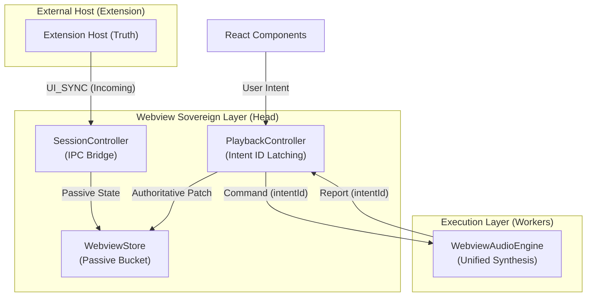
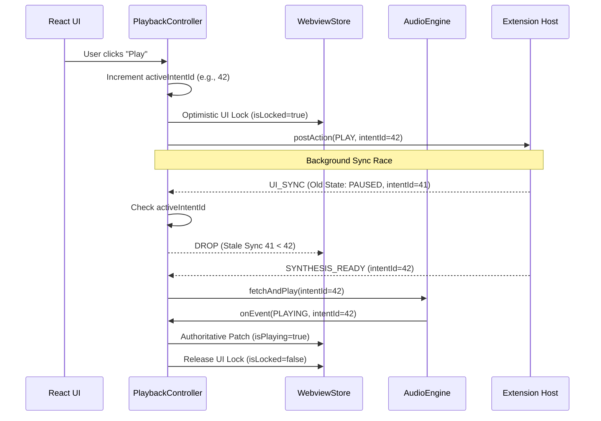

# State Sovereignty Audit Skill

This skill provides a rigorous framework for identifying, analyzing, and resolving state synchronization conflicts in distributed systems (e.g., VS Code Extension <-> Webview).

## 1. Tri-Layer Sovereign Architecture

### High-Level Blueprint
The system is divided into three functional layers to ensure absolute state sovereignty and prevent race conditions.

### Dynamics: The Sovereign Lifecycle (Example: JIT Play)
Every user action follows a guarded lifecycle to prevent "Split-Brain" state reverts.

## 2. The "Split-Brain" Audit Process

### Phase 1: Artifact Discovery
- **Identify State Containers**: Locate all files holding state (Stores, Engines, Controllers).
- **Scan for "Logic Leaks"**: Look for `if` statements or calculations inside data containers (Stores).
- **Audit Dependency Availability**: Instead of complex handshakes, check: "Can this component safely function if its dependency is missing/loading?"
- **Map Sovereignty Boundaries**: Trace how a user action flows. Ensure components check for availability proactively rather than waiting for pushes.

### Phase 2: Conflict Matrix (The "Truth Map")
Create a table for every major state variable. Identify its "Sovereign Owner".

| Variable | Current Owner | Logic Location | Redundancy | Risk |
| :--- | :--- | :--- | :--- | :--- |
| `isPlaying` | Engine + Store | Engine `play()` | Yes (Both) | Sync Race (Extension vs Engine) |
| `activeUri` | Store + UI | UI `useEffect` | Yes | State Flip-flopping |

### Phase 3: Sovereignty Evaluation
For each variable, apply the **Tri-Layer Sovereign Test**:
1.  **Passive Bucket?**: Is the Store *just* holding data? (If no, it's a Logic Leak).
2.  **Intent Lock?**: Does the Controller prevent external Syncs from overwriting a pending user intent?
3.  **Command Execution?**: Does the Engine execute commands without caring about the "World State"?

### 4. Standalone Sovereignty (The Pull Model)
Components should be as standalone as possible to prevent "Handshake Deadlocks".
1.  **Direct State Access**: Provide easy, streamlined access to managed state for other components.
2.  **Lazy Readiness**: Responsibility for checking dependency availability lies with the consumer, not the provider.
3.  **Minimal Handshaking**: Only use handshakes for critical external resources (e.g. Browser Audio Context). UI state should be optimistic and "Always Available".

### Intent-ID Latching
Ensure that every user action is tagged with a unique `intentId`.
- **Controller**: `this.activeIntentId++`
- **Engine**: `execute(command, intentId)`
- **Store**: Only accepts updates where `incoming.intentId >= current.intentId`.

### Passive Reconciliation
If a "Sync" packet arrives from the secondary source (e.g. the Extension):
1.  Check if a **Local Lock** is active.
2.  Compare `intentId` or `timestamp`.
3.  If local is sovereign, **DROP** the incoming packet or **QUEUE** it.

## 4. The "Audit Report" Template
When performing an audit, generate an internal report artifact with these sections:
- **Systemic Fragility**: Where do we have the highest risk of race conditions?
- **Redundancy Analysis**: Which variables can be consolidated or derived?
- **Sovereignty Roadmap**: Step-by-step plan to move logic to Controllers.
