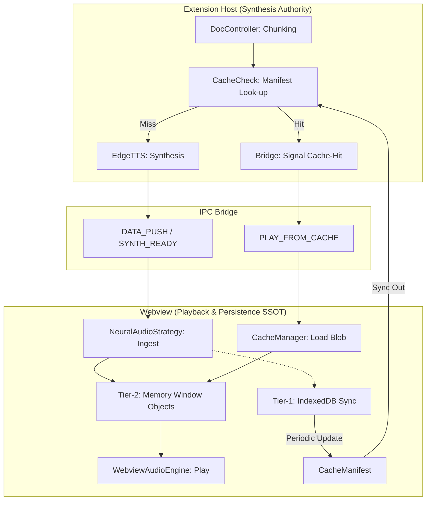

# System Context & Architecture Protocol

> [!IMPORTANT]
> This skill is the **Source of Truth (SSOT)** for the Read Aloud extension's internal systems. 
> **AGENT MANDATE**: If you modify, refactor, or introduce a new system that contradicts or extends the content below, you MUST update this skill in the same turn.

## 1. Architectural Map (Snapshot: 2026-04-08)

### 1.1 Core Backend (VS Code Extension)
- **`StateStore.ts`**: The central, reactive **EventEmitter** storing all document and playback status.
- **`SyncManager.ts`**: The **Observer** service. It listens to `StateStore`, applies 100ms throttling, session parity checks, and visibility-aware flushing to the UI.
- **`PlaybackEngine.ts`**: Orchestrates synthesis. Handles the transition between **Local** (SAPI/macOS) and **Neural** (Edge TTS) audio streams. Implements **Authoritative Stop** via unified AbortController hierarchy.
- **`DocController.ts`**: Document intelligence. Manages chunking, metadata extraction, and position tracking.
- **`SettingsManager.ts`**: The authority on configuration and persistence. Bridges `settings.json`, `globalState`, and the Agent's `extension_state.json`.
- **`DashboardRelay.ts`**: The IPC "Switchboard" for post-message communication with the Webview.
- **`McpWatcher.ts` / `McpBridge.ts`**: High-integrity integration with the agent's brain environment for real-time SITREP and command mirroring.

### 1.2 Frontend (Webview Sidebar)
- **`WebviewStore.ts`**: Global reactive store (Redux-lite). Maintained by `UI_SYNC` packets from `SyncManager`.
- **`CommandDispatcher.ts`**: Entry point for all incoming VS Code messages. Dispatches actions to the store or local services.
- **`MessageClient.ts`**: Outbound IPC wrapper. Used to send user commands (Play, Pause, Stop) back to VS Code.

### 1.3 Auditory Strategy & Caching (The Holistic Hierarchy)
- **`AudioStrategy` (Pattern)**: Decouples the synthesis engine from the playback controller.
- **`NeuralAudioStrategy.ts`**: The **Tier-2 (Memory)** cache layer in the Webview. Maintains a sliding window of `ObjectURL`s for the current and next 2 sentences to ensure zero latency.
- **`CacheManager.ts`**: The **Tier-1 (Persistent)** storage (SSOT). Uses **IndexedDB** (`ReadAloudAudioCache`) with a 100MB cap and 7-day TTL.
- **`cachePolicy.ts`**: The centralized authority for key generation across both environments.

## 2. Advanced Architectural Patterns

### 2.1 The "Ghost Focus" Multiplexer
Located in `extension.ts`, the `syncSelection()` function tracks document focus across tab changes, editor switches, and sidebar interactions. If no active editor exists (e.g., the webview has focus), it falls back to the last active tab or visible editor.

### 2.2 Brain Sensitivity Protocol
The extension uses a `FileSystemWatcher` on `~/.gemini/antigravity/brain`. When a new directory is created, it automatically pivots its internal session context to maintain parity with the active agent session.

### 2.3 Holistic Caching Policy (SSOT)
- **Keys**: All cache keys are generated via `cachePolicy.ts` using `[Text + VoiceID + Rate + EngineVersion]`.
- **Sovereign Manifest**: The Webview emits a `CacheManifest` (Set of IDs) to the Extension Host. 
- **Zero-Target Synthesis**: The Extension Host MUST check the `CacheManifest` before synthesis. If a key is present, synthesis is skipped, and the Webview is instructed to play from local disk.
- **Tiering**: 
    1. **Ext-RAM**: Ephemeral buffer for active synthesis delivery.
    2. **Web-RAM**: High-priority `ObjectURL` window (Active + Next 2).
    3. **Web-DB**: Persistent IndexedDB (The long-term SSOT).

- **Lifecycle**: Prefetch tasks are aborted immediately on `IntentId` increments (e.g., user skips forward).

### 2.5 Intent Sovereignty & Handshake Gate [v2.3.1]
- **Intent Sovereignty**: All synthesis and playback tasks MUST be tagged with a `playbackIntentId`. Components (Engine, Strategy, Buffer) MUST immediately eject tasks that do not match the current global intent. Intent IDs are initialized to `Date.now()` to prevent "Intent 0" race conditions during early boot.
- **Authoritative Stop**: The `stop()` command is universal. It triggers a cascade of aborts across all active segments, pre-fetch batches, and the primary synthesis lock. Following the abort, it performs a mandatory TTS re-initializer cycle to ensure a clean state for subsequent requests.
- **Handshake Gate**: The Webview (via `PlaybackController`) MUST block all synthesis requests and pre-fetching until the `isHandshakeComplete` flag is true (signaling that the initial `UI_SYNC` has been processed).
- **Control Sovereignty**: User actions (Play/Pause/Stop) in the Webview are authoritative. Upon a user click, the `PlaybackController` enters a **Sovereign Window (3.5s)**:
    - It increments the local `playbackIntentId`.
    - It sets `isAwaitingSync = true`.
    - It ignores all incoming `UI_SYNC` packets with lower `intentId`s to prevent "UI Flickering" or "Revert to Previous State" during async round-trips.
- **Instance Guard (Bridge stabilization)**: To prevent SSE "Bridge Storms" during rapid reloads, the `McpBridge` enforces a **200ms eviction delay** before force-purging stale sessions, allowing graceful lifecycle transitions.

## 3. Hook Protocol (Development Guide)

### 3.1 Extending State
- **Rule**: NEVER add independent local state to `SpeechProvider` or `DocController` if it needs to be reflected in the UI.
- **Action**: Add properties to the `StateStore` interface and `StateStore.init()`. 
- **Parity**: Update the `DashboardRelay.sync()` method to include the new data in the standard sync packet.

### 3.2 Adding a New Setting
- **Action**: Register the key in `package.json` (under `contributes.configuration`). Update `SettingsManager.ts` to map the configuration value into the `StateStore`.

### 3.3 Adding an IPC Command
- **Frontend**: Use `MessageClient.postMessage({ command: 'myCommand', ... })`.
- **Backend**: Update the `CommandDispatcher` on the backend (usually delegated to `SpeechProvider.onDidReceiveMessage`) to handle the incoming request.

## 4. Execution Trace: The "Play" Request
1. **Trigger**: User clicks Play in Webview.
2. **IPC (Out)**: `MessageClient.postMessage({ command: 'play' })`.
3. **Internal Logic**: `SpeechProvider.play()` -> `PlaybackEngine.start()`.
4. **State Update**: `StateStore` emits `change`.
5. **Sync (In)**: `SyncManager` throttles and sends `UI_SYNC` message to Webview via `DashboardRelay`.
6. **UI Update**: `WebviewStore` updates and React components re-render.

## 5. Holistic Audio Caching Flow (Visualization)

## 6. Maintenance Logic
- **Discovery**: Before starting a new task, check if the current `task.md` or `implementation_plan.md` suggests an architectural evolution.
- **Burn-down**: Once a component is refactored (e.g., `PlaybackEngine` -> `AudioStrategy`), update the **Architectural Map** above immediately.
- **Check-in**: If unsure where to "hook" a new feature, run a search for `StateStore` usage.
