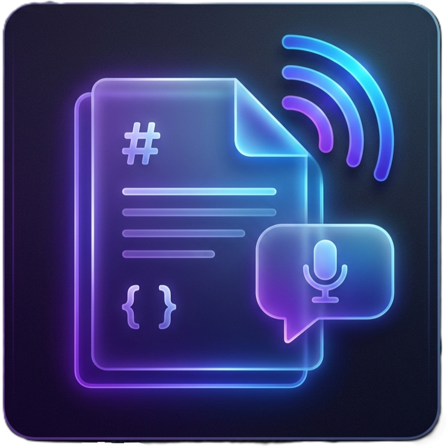

  
  <h1>🎙️ Virgo — AI that talks to YOU</h1>
  
<b>Give your AI coding assistant a voice. Cure reading fatigue, listen to architecture plans, and turn your IDE into an active collaborator.</b>

  
  
  

---

## The "Reading Fatigue" Trap

If you code with an AI agent (like Cursor, Claude Desktop, or Antigravity), you know the loop: 
You ask for a feature. The AI generates a massive implementation plan. You stop what you're doing, read it, and approve it. Then you ask for the next feature. *Another* massive plan. 

After an hour, **reading fatigue** sets in. You stop reading the plans. You just skim them, blindly type `"GO"`, and hope for the best. 

Eventually, the AI hallucinates or breaks the system—and you are stuck in a 2-day rollback loop trying to un-f*** what it just did.

## The Virgo Solution

**Virgo** solves the fatigue trap by turning your AI into a vocal collaborator. Instead of stopping to read a wall of text, Virgo reads the plan to you out loud using highly natural Neural Voices. 

You can keep your eyes on the codebase, review the actual diffs, and listen to the agent's strategy at the exact same time. 

*(More sections coming...)*

## Core Use Cases

**1. The Agent Narrator**
Listen to implementation plans and code reviews while keeping your eyes on the codebase. Skip skimming long text blocks and let your AI agent read its strategy aloud.

**2. Task Handoffs**
When running a deep audit or complex refactor, agents can proactively notify you when the task is complete. Instead of watching a terminal, you get an audible status report.

**3. Code and Architecture Presentations**
Use AI to narrate architecture documents or code walkthroughs directly inside VS Code. Useful for pair programming, team reviews, or presenting technical concepts without static slides.

## ⚡ Quick Start

1. Install Virgo from the VS Code Marketplace.
2. Open any Markdown (`.md`) file.
3. Press `Alt + R` (or run `Virgo: Play` from the Command Palette).

## 🤖 For AI Agents (MCP Integration)

Virgo serves as a native voice channel for AI assistants like Cursor, Claude Desktop, and Antigravity. By connecting the `virgo` MCP server, agents can use the `say_this_loud` tool to bypass text chat and speak directly to you.

**To connect your agent:**
*Prerequisite: You must have [Node.js](https://nodejs.org/) installed on your machine to run the MCP server.*
1. Open the VS Code Command Palette (`Ctrl+Shift+P` / `Cmd+Shift+P`).
2. Run **`Virgo: Copy MCP Configuration`**.
3. Paste the copied JSON directly into your agent's MCP settings file.

Once connected, your agent gains the `say_this_loud` tool.

## 🛡️ Privacy & Transparency

Virgo uses Microsoft Edge Neural TTS to generate high-quality voice output. 
- **No API Keys Required:** It works out of the box.
- **Cloud Synthesis:** Text is securely sent to Microsoft's TTS servers for synthesis.
- **Zero Local Storage:** We do not store, log, or cache your document content on our servers.
- **Zero Telemetry:** We collect absolutely no usage data, analytics, or error telemetry. What happens in your IDE stays in your IDE.

## 🐞 Feedback & Bug Reports

This repository serves exclusively as a public issue tracker for user feedback, bug reports, and feature requests. 

**Note: We do not accept Pull Requests at this time.** If you encounter an issue or have an idea to improve Virgo, please [open an Issue on GitHub](https://github.com/IdanDavidAviv/virgo/issues).

## 📄 License & Commercial Use

Virgo is released under a **Custom Non-Commercial License**.
- **Free for personal, academic, and open-source use.**
- **Commercial use is strictly prohibited** without explicit written approval.

If you wish to use Virgo or its underlying code for a commercial purpose (e.g., integrating it into a paid product or service), you must obtain a commercial license. Please contact the author directly or open an Issue to request commercial licensing. See the [LICENSE](LICENSE) file for full details.

---

**Enjoying Virgo?** [Buy me a coffee ☕](https://buymeacoffee.com/idandavidaviv)
