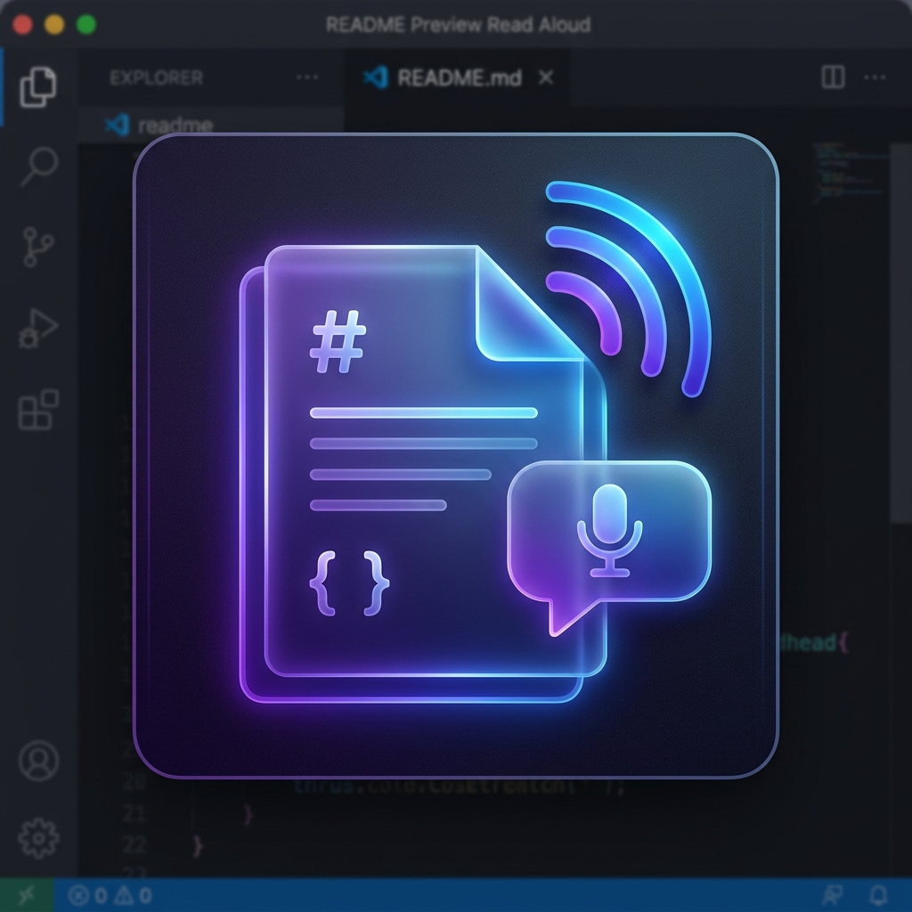
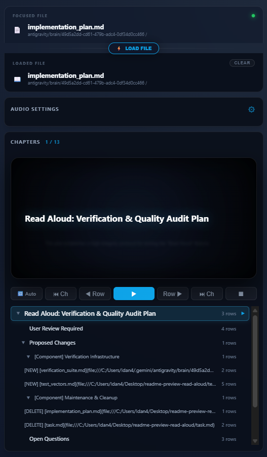

# 🎙️ README Preview Read Aloud

**Transform your Markdown documentation into a premium, immersive listening experience directly inside VS Code.**

## ✨ Features

- **Mission Control Dashboard**: A high-fidelity, interactive interface to manage your reading session.
- **AST-Powered Parsing**: Precise sentence tracking using `markdown-it`, ensuring accurate playback and highlighting.
- **Smart Navigation**: Skip by sentence, jump between chapters, or read from a specific cursor position.
- **Cross-Platform Support**: Built-in support for Windows, macOS, and Linux native voices.
- **Premium Aesthetics**: Glassmorphism UI with smooth transitions and real-time progress tracking.

## 🚀 Getting Started

### Installation
Install the extension from the [VS Code Marketplace](https://marketplace.visualstudio.com/items?itemName=IdanDavidAviv.readme-preview-read-aloud).

### Usage
- `Alt + R`: Start reading from the beginning or resume.
- `Alt + S`: Stop playback and clear the engine.
- `Alt + Shift + R`: Start reading from the current cursor position.
- **Show Dashboard**: Click the 🔄 icon in the editor title bar to open Mission Control.

## 🛠️ Dashboard: Mission Control

The "Mission Control" dashboard provides a centralized hub for your audio experience:
- **Chapter Navigation**: Click any chapter header to jump.
- **Volume & Pitch Control**: Tune the voice to your preference.
- **Live Scripting**: See exactly what's being read in real-time.

## 🛡️ Privacy & Telemetry

We value your privacy.
- **No Data Collection**: This extension does not send your document content to any external servers.
- **Local Synthesis**: All speech synthesis is performed locally on your machine or via direct browser APIs.
- **Anonymized Telemetry**: We collect minimal, anonymized usage data (e.g., successful synthesis events, errors) to improve extension stability. No PII (Personally Identifiable Information) or document text is ever logged.
- **Opt-Out**: You can disable telemetry at any time by setting `telemetry.enableTelemetry` to `false` in VS Code settings.

## 📄 License

Licensed under the [MIT License](LICENSE).

---

Developed with ❤️ by [Idan David Aviv](https://github.com/IdanDavidAviv)
