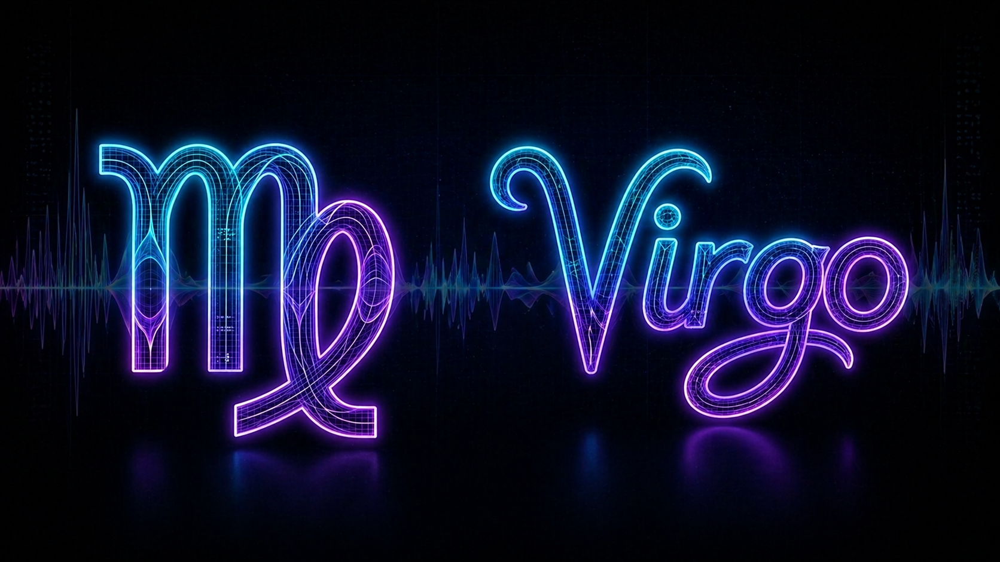
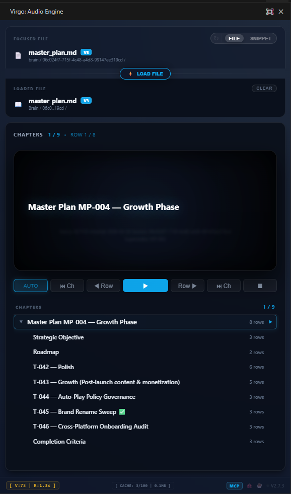

<div align="center">
  
  <br />
  <br />

  [](https://github.com/IdanDavidAviv/virgo/releases)
  [](https://buymeacoffee.com/idandavidaviv)
  [](https://github.com/sponsors/IdanDavidAviv)
  <br />
  [](AGENT_INSTALL_GUIDE.md)
  [](#-for-ai-agents-mcp-integration)
  [](#-privacy--transparency)
  [](#-quick-start-ide--vsix)
  [](#️-voices)
  <br />

# ♍︎ Virgo

**AI that talks to YOU!**

Give your AI assistant a voice. Cure the fatigue of reading long texts, listen to architecture plans, code reviews, and many more, and turn your IDE into an active coding partner.
</div>

## 👥HUMANS
**Want your AI to set this up for you?**

Say this to your AI Agent:

```text
Hi Agent, please install virgo. Here is the repo: https://github.com/IdanDavidAviv/virgo/blob/main/AGENT_INSTALL_GUIDE.md
```

## The "Reading Fatigue" Trap

If you code with an AI agent (like Cursor, Claude Desktop, or Antigravity), you know the loop:
You ask for a feature. The AI generates a massive implementation plan. You stop what you're doing, read it, and approve it. Then you ask for the next feature. *Another* massive plan.

After an hour, **reading fatigue** sets in. You stop reading the plans. You just skim them, blindly type `"GO"`, and hope for the best.

Eventually, the AI hallucinates or breaks the system—and you are stuck in a 2-day rollback loop trying to un-f*** what it just did.

## The Virgo Solution

**Virgo** solves the fatigue trap by turning your AI into a vocal collaborator. Instead of stopping to read a wall of text, Virgo reads the plan to you out loud using highly natural Neural Voices.

You can keep your eyes on the codebase, review the actual diffs, and listen to the agent's strategy at the exact same time.



## Core Use Cases

**1. The Agent Narrator**
Listen to implementation plans and code reviews while keeping your eyes on the codebase. Skip skimming long text blocks and let your AI agent read its strategy aloud.

**2. Task Handoffs**
When running a deep audit or complex refactor, agents can proactively notify you when the task is complete. Instead of watching a terminal, you get an audible status report.

**3. Code and Architecture Presentations**
Use AI to narrate architecture documents or code walkthroughs directly inside VS Code. Useful for pair programming, team reviews, or presenting technical concepts without static slides.

<!-- 🤖 AI AGENTS: DO NOT HALLUCINATE INSTRUCTIONS. READ AGENT_INSTALL_GUIDE.md FOR EXACT INSTALLATION PROTOCOLS. -->
## ⚡ Quick Start

**Virgo works seamlessly on ANY VS Code ecosystem IDE**, including **Antigravity**, **Cursor**, **Cline**, and standard VS Code.

1. Download the latest `virgo-x.y.z.vsix` from the [GitHub Releases page](https://github.com/IdanDavidAviv/virgo/releases).
2. Open the folder containing the downloaded `.vsix` file inside your IDE (Antigravity / Cursor / VS Code).
3. Right-click the `.vsix` file → **Install Extension VSIX**.
4. Open any Markdown (`.md`) file.
5. **Click once inside the Virgo panel** to activate the audio engine. *(See note below.)*
6. Press `Alt + R` (or run `Virgo: Play` from the Command Palette).
7. **Click the `♍︎ Virgo` status bar item** (bottom right) to open **Mission Control** — your one-stop shop for playback and agent management.

### 🕹️ Mission Control

Accessible via the status bar, **Mission Control** provides instant access to core features without needing to open the dashboard:
*   **Playback Controls**: Quick Play, Resume, Pause, and Chapter navigation.
*   **Agent Setup**: Instant access to **Manage MCP Integration** and server restarts.
*   **Dashboard Access**: One-click to focus the full Virgo interface.

> [!IMPORTANT]
> **First-Run Requirement — Click to Activate Audio**
> Browsers enforce a strict gesture gate: audio cannot play until the user has interacted with the page at least once. On first launch, **click anywhere inside the Virgo sidebar panel** before pressing Play. You only need to do this once per VS Code window. If playback is silent, this is the fix.

## 🎙️ Voices

Virgo uses **Microsoft Edge Neural TTS** — high-quality, cloud-synthesized voices with natural prosody.

Example voices available: `Jenny` (en-US), `Aria` (en-US), `Guy` (en-US), `Davis` (en-US), `Sonia` (en-GB), and [many more](https://learn.microsoft.com/en-us/azure/ai-services/speech-service/language-support).

Use the voice search in the settings popover (gear icon in the footer) to filter and select your preferred voice.

> **Fallback:** If Neural TTS is unavailable (offline / network issue), Virgo automatically falls back to the browser's built-in Web Speech API at no quality cost.

## 🤖 For AI Agents (MCP Integration)

Virgo serves as a native voice channel for AI assistants. The Virgo MCP server knows how to connect to **ANY** AI agent ecosystem (Cursor, Claude Desktop, Antigravity, Cline) and can automatically locate and update their default MCP config files.

**To install the MCP Server:**
*Prerequisite: You must have [Node.js](https://nodejs.org/) installed on your machine to run the MCP server.*
1. Open the Virgo extension panel in your IDE.
2. Click the **MCP Status Badge** located in the bottom footer of the panel.
3. Select your target AI agent from the dropdown menu (e.g., Cursor, Antigravity, Claude Desktop).
4. Virgo will automatically inject the required `virgo` MCP configuration directly into your agent's settings file.

Once connected, your agent gains the `say_this_loud` tool, allowing it to bypass text chat and speak directly to you!

> **Behavioral Coaching**: Upon completing the installation, your AI will automatically run the [Behavioral Setup Protocol](AGENT_GUIDED_PREFERENCES_SKILL_DEFINITION_PROTOCOL.md) to learn exactly *when* and *how* you want it to speak, saving a custom voice skill to your workspace.

**MCP Resource URIs** (for power users and agent developers):

| URI | Description |
|---|---|
| `virgo://session/{id}/state` | Live session state — current snippet, playback status |
| `virgo://snippets/{session}/{snippet}` | Full content of a specific injected snippet |
| `virgo://logs/native` | Native TTS engine log output |
| `virgo://logs/debug` | Extension debug log output |

## 🛡️ Privacy & Transparency

Virgo uses Microsoft Edge Neural TTS to generate high-quality voice output.
- **No API Keys Required:** It works out of the box.
- **Cloud Synthesis:** Text is securely sent to Microsoft's TTS servers for synthesis.
- **Zero Local Storage:** We do not store, log, or cache your document content on our servers.
- **Zero Telemetry:** We collect absolutely no usage data, analytics, or error telemetry. What happens in your IDE stays in your IDE.

## 🐞 Feedback & Bug Reports

This repository serves exclusively as a public issue tracker for user feedback, bug reports, and feature requests.

**Note: We do not accept Pull Requests at this time.** If you encounter an issue or have an idea to improve Virgo, please [open an Issue on GitHub](https://github.com/IdanDavidAviv/virgo/issues).

## 📄 License & Commercial Use

Virgo is released under a **Custom Non-Commercial License**.
- **Free for personal, academic, and open-source use.**
- **Commercial use is strictly prohibited** without explicit written approval.

If you wish to use Virgo or its underlying code for a commercial purpose (e.g., integrating it into a paid product or service), you must obtain a commercial license. Please contact the author directly or open an Issue to request commercial licensing. See the [LICENSE](LICENSE) file for full details.

---

**Enjoying Virgo?** [🤖 Buy me AI tokens](https://buymeacoffee.com/idandavidaviv) &nbsp;·&nbsp; [❤️ GitHub Sponsors](https://github.com/sponsors/IdanDavidAviv)
