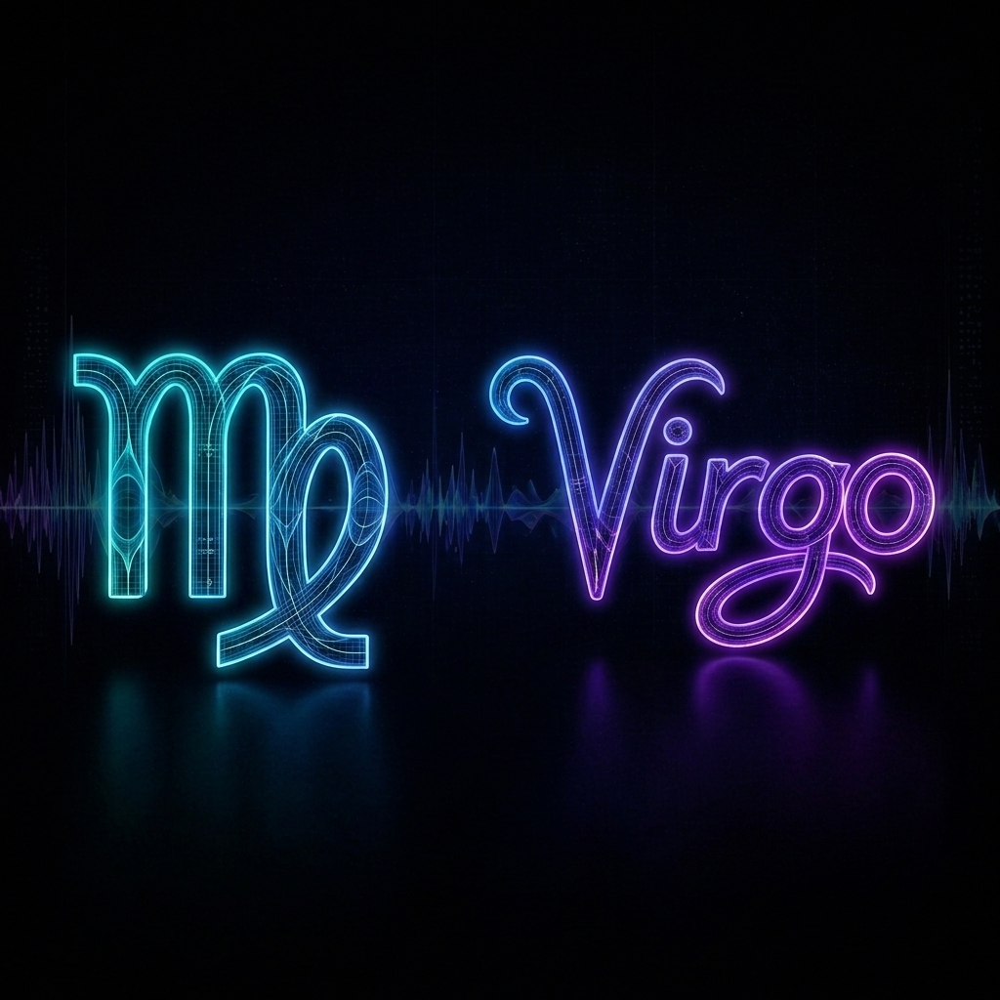
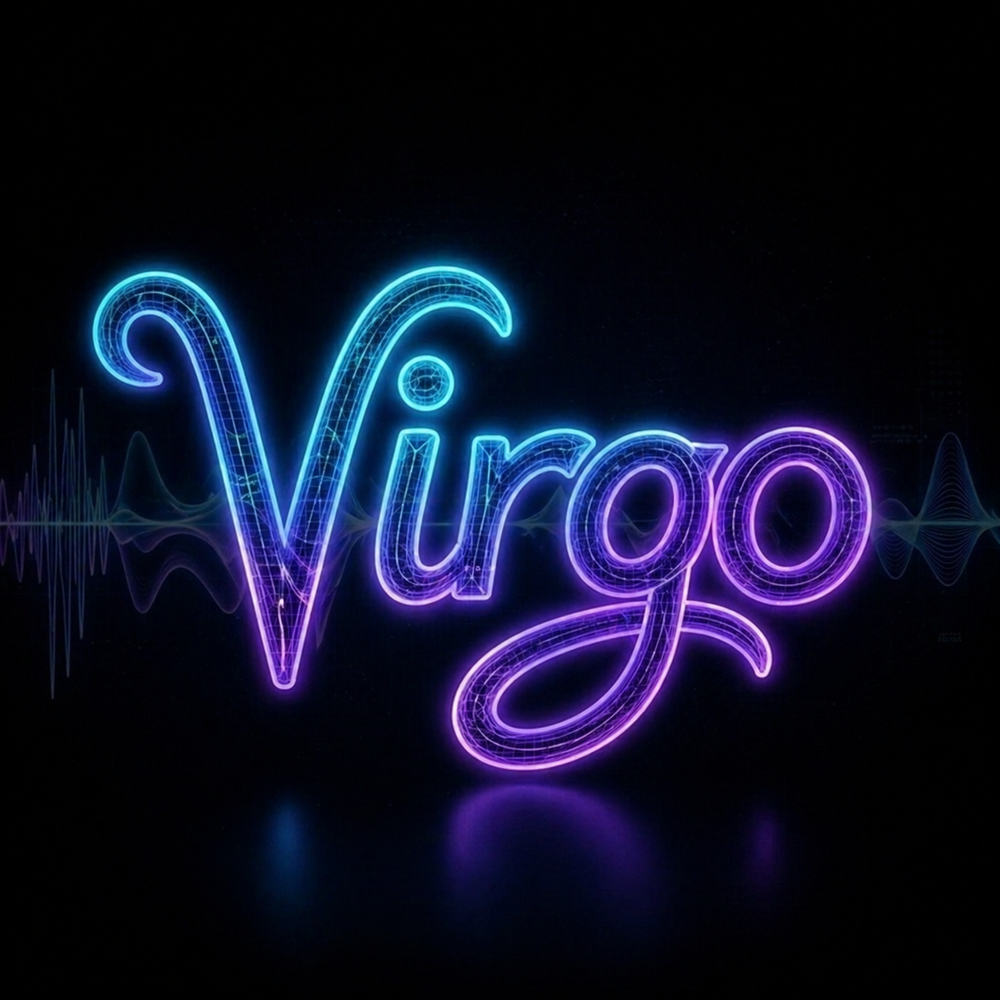
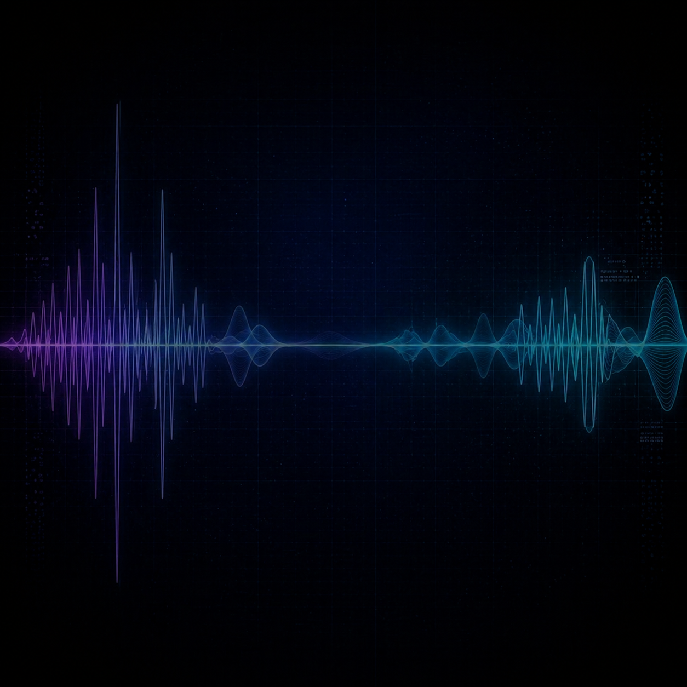
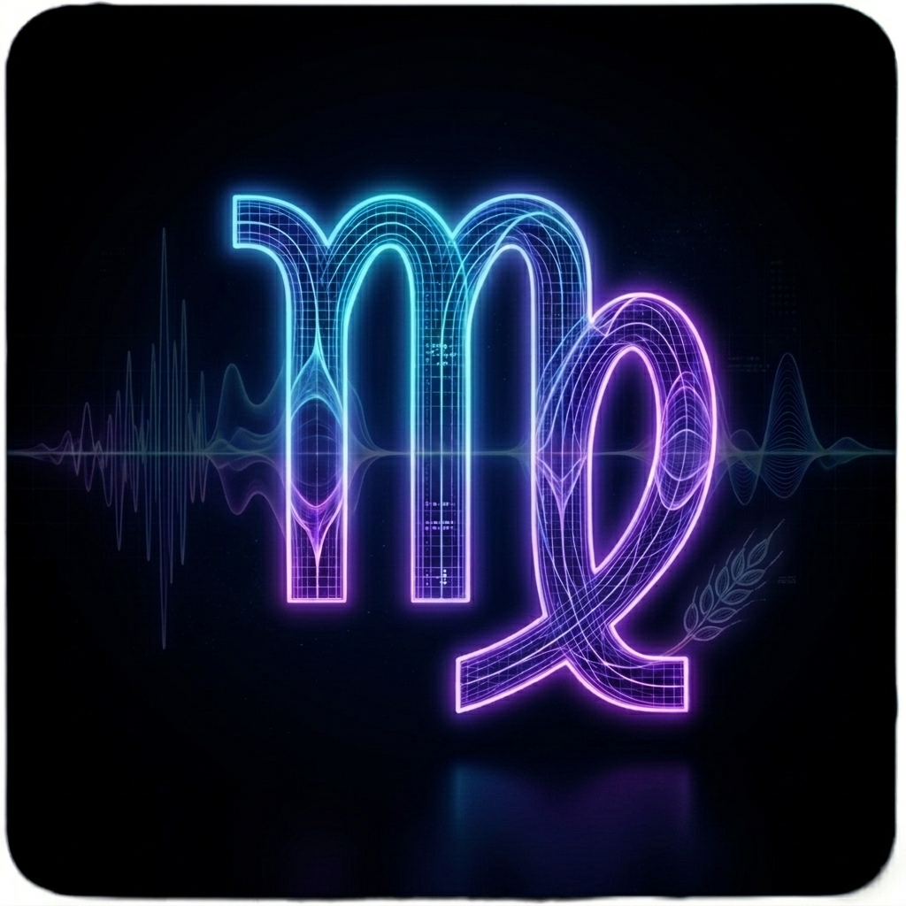
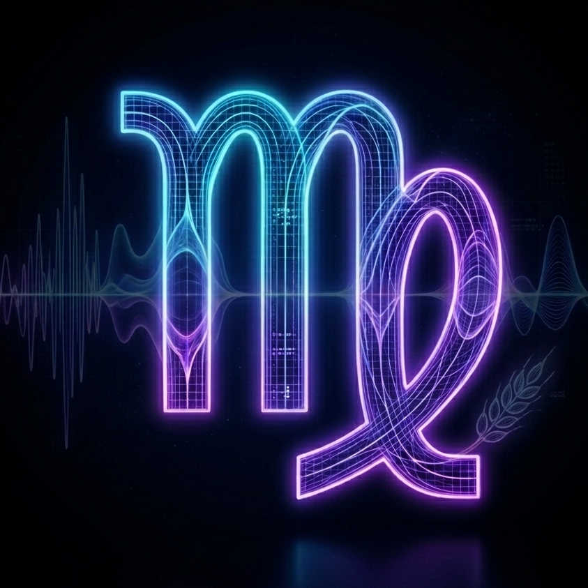

# Virgo: Visual Identity & Brand Assets

## 🟢 FULL LOGO VARIANT (FLUID GRADIENT)
**Status:** Approved by User.
**File:** `virgo_symbol_and_text_fluid.png`
**Rationale:** Preserves the original locked spacing but applies a single continuous fluid gradient from cyan to violet across both the symbol and wordmark for a unified look.

---

## 🟢 FINAL LOCKED WORDMARK
**Status:** Approved by User (Generated via ChatGPT).
**File:** `virgo_wordmark.png`
**Rationale:** Perfectly matches the geometry, electric cyan/violet-blue gradients, and fluid glassmorphic tubing of the master 'm' reference. The harmony is completely achieved.

---

## 🟢 FINAL LOCKED BACKGROUND TEXTURE
**Status:** Approved by User (Generated via ChatGPT).
**File:** `virgo_background_wave.png`
**Rationale:** The pure, ultimate dark void with smooth horizontal oscilloscope soundwaves, perfect for compositing behind the wordmark and icon for the Social Banner.

---

## The Master Constraint & Reference Images
The typography must be inspired **solely** by the fluid, connected, glassmorphic curves of the Virgo 'm' symbol. It must perfectly match the aesthetic, lighting, and texture of the final locked icons below.

### Master Reference: The Aesthetic (Iteration 4 Dark)

### Master Reference: The Final Logo (Cropped)

---

## Generation Blueprint (DALL-E 3 Prompt)
*This exact configuration was executed to generate the finalized visual assets.*

**Tool Payload:**
- **ImagePaths:**
  1. `./virgo_icon.png` (For the specific geometric curve of the 'm' and background texture)
- **Prompt:**
  > A premium typography logo spelling the word "Virgo" (capital V, lowercase irgo). The text should be a beautiful, harmonious, custom geometric script that flows gracefully. The visual style must exactly match the provided reference image: use the same thick, glassmorphic, liquid-neon tubular lines. The colors must strictly match the reference—a rich, vibrant electric cyan and violet-blue inner glow against a pure ultimate dark void background. The word "Virgo" must feel like a perfectly harmonious, continuous extension of the symbol in the reference, sharing the exact same elegant flow, defined structure, and rounded stroke terminals.
